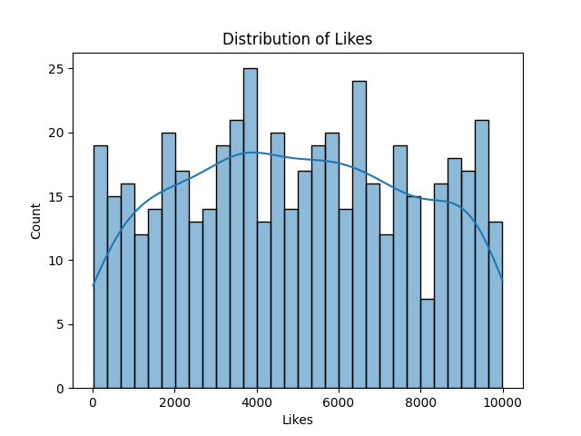
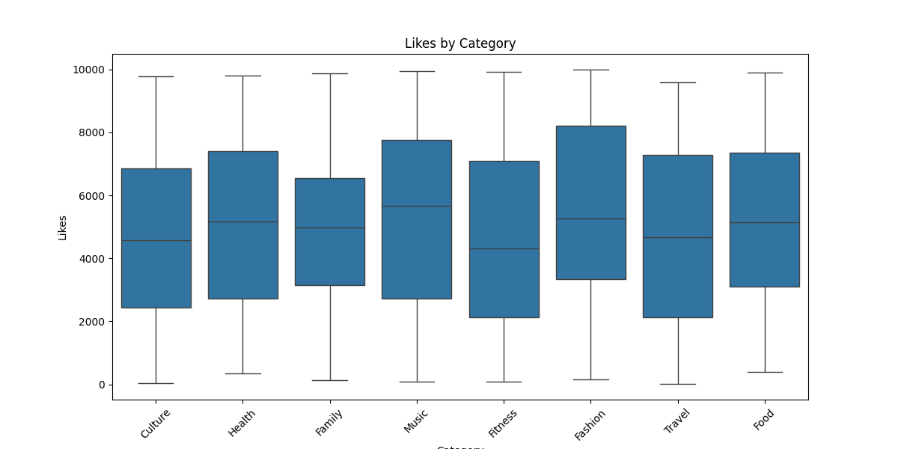

# Instagram Data Analysis Project

This project simulates and analyzes random Instagram-like social media data using Python, Pandas, Seaborn, and Matplotlib. 
The aim is to explore user engagement patterns by categorizing posts and analyzing the distribution of likes across different content categories,
in order to find insights to improve social media performance.

## Project Features

- **Data Generation**: Simulated data for Instagram posts with random dates, categories, and likes (0–10,000).
- **Data Cleaning**: Null values and duplicates were removed, and appropriate data types were enforced for better data consistency.
- **Data Analysis**: Statistical insights were generated for the average likes across categories.
- **Data Visualization**: 
    - **Histogram**: Displaying the distribution of likes.
    - **Boxplot**: Comparing likes across different content categories.

## Visualizations

1. **Likes Distribution (Histogram)**: A visual representation of the frequency of posts based on the number of likes.
   

2. **Likes by Category (Boxplot)**: Shows how the number of likes varies across different content categories.
   

## Technologies Used

- **Python**: Main language for data generation and analysis
- **Pandas**: For data manipulation and analysis
- **Seaborn & Matplotlib**: For creating visualizations
- **Jupyter Notebook**: For interactive data analysis and exploration

## How to Run the Project

1. Clone or download this repository:
   ```bash
   git clone https://github.com/caitlinanalyzeseverything/instagram-data-analysis.git
   
2. pip install -r requirements.txt

3. jupyter notebook social_media_analysis.ipynb
   
4. Run each cell in the notebook to reproduce the analysis and view the results.

Key Takeaways & Recommendations
After analyzing the average likes and engagement efficiency across social media categories, several key patterns emerged:

Top-Performing Categories
Family, Health, and Music consistently delivered the highest average likes per post — over 5,200 likes.

Despite having fewer total posts, Music outperformed more frequent categories in efficiency, showing that quality outpaces quantity.

Recommendation:
Prioritize content in these high-performing categories. Increase post frequency cautiously while maintaining content quality. 
These categories are ideal for promotions, influencer collaborations, or audience growth strategies.

Mid-Tier Categories
Fitness, Fashion, and Culture received moderate engagement, with average likes per post around 4,800–4,900.

These are stable but show potential for optimization.

Recommendation:
Experiment with content variations — such as videos, behind-the-scenes reels, or time-of-day adjustments — to boost engagement.
Use A/B testing to refine messaging and formats.

Underperforming Categories
Travel had the highest number of posts, but one of the lowest engagement rates.
Food also showed low average engagement per post, despite moderate frequency.

Recommendation:
Reassess your strategy for these categories. Consider reducing post frequency, updating content styles, or targeting more specific
sub-niches (e.g., budget travel, viral recipes). If performance doesn’t improve, shift focus to better-performing categories.

Strategic Observations
Engagement ≠ Volume: More posts don’t guarantee better results. Music and Family had fewer posts but much higher likes per post than Travel.
Efficiency Matters: Likes-per-post is a key metric for optimizing social media ROI. Focus on content that delivers results consistently.
Data-Driven Decisions: These insights provide clear guidance on what content to scale, improve, or reconsider.

Next Steps & Future Improvements
Incorporate time-of-day and day-of-week analysis to fine-tune posting schedules.
Track longitudinal performance by repeating this analysis over multiple months or campaigns.
Introduce follower count or reach metrics (if available) to analyze engagement rates more holistically.

Contributing
If you'd like to contribute to this project, feel free to fork it, submit issues, or create pull requests. Contributions are always welcome!

Feel free to reach out with any questions or feedback:
Email: caitlinericson1@outlook.com
LinkedIn: www.linkedin.com/in/caitlin-ericson


